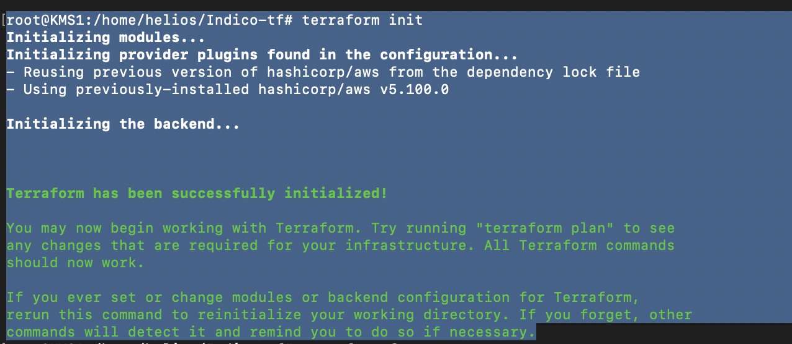
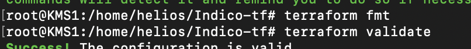
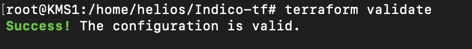

# Indico-tf

Terraform module untuk men-deploy containerized application di AWS menggunakan ECS Fargate, dilengkapi CI/CD pipeline via CodePipeline dan CodeBuild, serta Application Load Balancer sebagai entry point.

---

## Overview

Proyek ini menyediakan infrastruktur as code yang mencakup:

- **ECS Fargate** — menjalankan container tanpa perlu manage EC2
- **Application Load Balancer (ALB)** — mendistribusikan traffic ke ECS service
- **AWS CodeBuild** — build image dari source code GitHub
- **AWS CodePipeline** — orkestrasi CI/CD dari source → build → deploy ke S3
- **CloudWatch Logs** — logging untuk ECS task dan CodeBuild
- **IAM Roles** — least-privilege roles untuk setiap service

Semua resource diorganisir ke dalam modul terpisah sehingga mudah di-reuse dan dikustomisasi per environment.

---

## Architecture

```
Internet
    │
    ▼
┌─────────────────────────────────────────────────────────────────┐
│                     AWS Cloud (ap-southeast-1)                  │
│                                                                 │
│  ┌──────────────┐     ┌───────────────────────────────────┐    │
│  │    GitHub    │     │        VPC (sudah ada)             │    │
│  │  Repository  │     │                                   │    │
│  └──────┬───────┘     │  ┌──────────────────────────────┐ │    │
│         │ webhook     │  │      Public Subnets           │ │    │
│         ▼             │  │      (sudah ada)              │ │    │
│  ┌──────────────┐     │  │                               │ │    │
│  │ CodePipeline │     │  │  ┌──────────┐  ┌──────────┐  │ │    │
│  │              │     │  │  │   ALB    │  │   ECS    │  │ │    │
│  │  Stage 1:    │     │  │  │ (port 80)│─▶│ Fargate  │  │ │    │
│  │   Source     │     │  │  └──────────┘  │  Task    │  │ │    │
│  │              │     │  │               └──────────┘  │ │    │
│  │  Stage 2:    │     │  └──────────────────────────────┘ │    │
│  │   Build ─────┼─────┼──▶  CodeBuild                    │    │
│  │  (CodeBuild) │     │     (build image)                 │    │
│  │              │     │                                   │    │
│  │  Stage 3:    │     │  ┌─────────────────────────────┐  │    │
│  │   Deploy ────┼─────┼──▶  S3 Bucket (artifacts)      │  │    │
│  └──────────────┘     │  └─────────────────────────────┘  │    │
│                       └───────────────────────────────────┘    │
│                                                                 │
│  CloudWatch Logs (/ecs/*, /codebuild/*)                        │
└─────────────────────────────────────────────────────────────────┘
```

### Struktur Modul

```
Indico-tf/
├── main.tf                    # Root module, memanggil semua sub-modul
├── variables.tf               # Input variables
├── outputs.tf                 # Output values
├── modules/
│   ├── alb/                   # Application Load Balancer
│   ├── ecs/                   # ECS Cluster
│   ├── codebuild/             # CodeBuild Project
│   └── codepipeline/          # CodePipeline
└── examples/
    └── complete/              # Example
        ├── main.tf
        ├── variables.tf
        ├── outputs.tf
        └── terraform.tfvars.example
```

---

## Asumsi


1. VPC sudah ada

2. Subnet sudah ada

3. GitHub sebagai source

4. Container image dapat diakses ECS

5. HTTPS opsional — ALB saat ini hanya listen di port 80 (HTTP). Konfigurasi HTTPS tersedia tapi dikomentari. Untuk mengaktifkan, uncomment `certificate_arn` di `variables.tf` dan tambahkan HTTPS listener di modul ALB.

---

## Quickstart

### Prerequisites

- Terraform >= 1.5.0
- Configure AWS CLI 
- Existing VPC dan Subnet 
- Prepare Github Repo
- GitHub PAT

### 1. Clone repository

```bash
git clone https://github.com/adzimatohari24/Indico-tf.git
cd Indico-tf
```

### 2. Buat file tfvars

```bash
cp examples/complete/terraform.tfvars.example terraform.tfvars
```

Edit `terraform.tfvars` dan sesuaikan nilainya:

```hcl
aws_region   = "ap-southeast-1"
project_name = "myapp"
environment  = "dev"

# Sesuaikan dengan VPC dan Subnet yang sudah ada
vpc_id     = "vpc-0abc12345"
subnet_ids = ["subnet-0abc12345", "subnet-0def67890"]

# Container
container_name  = "myapp"
container_image = "nginx:latest"
container_port  = 80

# GitHub
repo_owner         = "your-github-username"
repo_name          = "your-repo-name"
branch             = "main"
repo_url           = "https://github.com/your-github-username/your-repo-name.git"
github_oauth_token = "ghp_xxxxxxxxxxxxxxxxxxxx"
webhook_secret     = "your-random-secret-string"
```

> **Penting:** Pastikan `terraform.tfvars` sudah masuk ke `.gitignore` karena berisi token sensitif.

### 3. Deploy

- terraform init
- terraform fmt
- terraform validate
- terraform plan
- terraform apply

# Result :

### 1. Terraform init


### 2. Terraform fmt


### 3. Terraform validate


### 4. Terraform plan
root@KMS1:/home/helios/Indico-tf# terraform plan

Terraform used the selected providers to generate the following execution plan. Resource actions are indicated with the following symbols:
  + create

Terraform will perform the following actions:

  # module.alb.aws_lb.this will be created
  + resource "aws_lb" "this" {
      + arn                                                          = (known after apply)
      + arn_suffix                                                   = (known after apply)
      + client_keep_alive                                            = 3600
      + desync_mitigation_mode                                       = "defensive"
      + dns_name                                                     = (known after apply)
      + drop_invalid_header_fields                                   = false
      + enable_deletion_protection                                   = false
      + enable_http2                                                 = true
      + enable_tls_version_and_cipher_suite_headers                  = false
      + enable_waf_fail_open                                         = false
      + enable_xff_client_port                                       = false
      + enable_zonal_shift                                           = false
      + enforce_security_group_inbound_rules_on_private_link_traffic = (known after apply)
      + id                                                           = (known after apply)
      + idle_timeout                                                 = 60
      + internal                                                     = false
      + ip_address_type                                              = (known after apply)
      + load_balancer_type                                           = "application"
      + name                                                         = "demo-dev-alb"
      + name_prefix                                                  = (known after apply)
      + preserve_host_header                                         = false
      + security_groups                                              = (known after apply)
      + subnets                                                      = [
          + "subnet-xxxxxx",
        ]
      + tags                                                         = {
          + "Environment" = "dev"
          + "ManagedBy"   = "Terraform"
          + "Project"     = "demo"
        }
      + tags_all                                                     = {
          + "Environment" = "dev"
          + "ManagedBy"   = "Terraform"
          + "Project"     = "demo"
        }
      + vpc_id                                                       = (known after apply)
      + xff_header_processing_mode                                   = "append"
      + zone_id                                                      = (known after apply)

      + subnet_mapping (known after apply)
    }

  # module.alb.aws_lb_listener.http will be created
  + resource "aws_lb_listener" "http" {
      + arn                                                                   = (known after apply)
      + id                                                                    = (known after apply)
      + load_balancer_arn                                                     = (known after apply)
      + port                                                                  = 80
      + protocol                                                              = "HTTP"
      + routing_http_request_x_amzn_mtls_clientcert_header_name               = (known after apply)
      + routing_http_request_x_amzn_mtls_clientcert_issuer_header_name        = (known after apply)
      + routing_http_request_x_amzn_mtls_clientcert_leaf_header_name          = (known after apply)
      + routing_http_request_x_amzn_mtls_clientcert_serial_number_header_name = (known after apply)
      + routing_http_request_x_amzn_mtls_clientcert_subject_header_name       = (known after apply)
      + routing_http_request_x_amzn_mtls_clientcert_validity_header_name      = (known after apply)
      + routing_http_request_x_amzn_tls_cipher_suite_header_name              = (known after apply)
      + routing_http_request_x_amzn_tls_version_header_name                   = (known after apply)
      + routing_http_response_access_control_allow_credentials_header_value   = (known after apply)
      + routing_http_response_access_control_allow_headers_header_value       = (known after apply)
      + routing_http_response_access_control_allow_methods_header_value       = (known after apply)
      + routing_http_response_access_control_allow_origin_header_value        = (known after apply)
      + routing_http_response_access_control_expose_headers_header_value      = (known after apply)
      + routing_http_response_access_control_max_age_header_value             = (known after apply)
      + routing_http_response_content_security_policy_header_value            = (known after apply)
      + routing_http_response_server_enabled                                  = (known after apply)
      + routing_http_response_strict_transport_security_header_value          = (known after apply)
      + routing_http_response_x_content_type_options_header_value             = (known after apply)
      + routing_http_response_x_frame_options_header_value                    = (known after apply)
      + ssl_policy                                                            = (known after apply)
      + tags                                                                  = {
          + "Environment" = "dev"
          + "ManagedBy"   = "Terraform"
          + "Project"     = "demo"
        }
      + tags_all                                                              = {
          + "Environment" = "dev"
          + "ManagedBy"   = "Terraform"
          + "Project"     = "demo"
        }
      + tcp_idle_timeout_seconds                                              = (known after apply)

      + default_action {
          + order            = (known after apply)
          + target_group_arn = (known after apply)
          + type             = "forward"
        }

      + mutual_authentication (known after apply)
    }

  # module.alb.aws_lb_target_group.this will be created
  + resource "aws_lb_target_group" "this" {
      + arn                                = (known after apply)
      + arn_suffix                         = (known after apply)
      + connection_termination             = (known after apply)
      + deregistration_delay               = "300"
      + id                                 = (known after apply)
      + ip_address_type                    = (known after apply)
      + lambda_multi_value_headers_enabled = false
      + load_balancer_arns                 = (known after apply)
      + load_balancing_algorithm_type      = (known after apply)
      + load_balancing_anomaly_mitigation  = (known after apply)
      + load_balancing_cross_zone_enabled  = (known after apply)
      + name                               = "demo-dev-tg"
      + name_prefix                        = (known after apply)
      + port                               = 80
      + preserve_client_ip                 = (known after apply)
      + protocol                           = "HTTP"
      + protocol_version                   = (known after apply)
      + proxy_protocol_v2                  = false
      + slow_start                         = 0
      + tags                               = {
          + "Environment" = "dev"
          + "ManagedBy"   = "Terraform"
          + "Project"     = "demo"
        }
      + tags_all                           = {
          + "Environment" = "dev"
          + "ManagedBy"   = "Terraform"
          + "Project"     = "demo"
        }
      + target_type                        = "ip"
      + vpc_id                             = "vpc-xxxxxxx"

      + health_check {
          + enabled             = true
          + healthy_threshold   = 2
          + interval            = 30
          + matcher             = "200"
          + path                = "/"
          + port                = "traffic-port"
          + protocol            = "HTTP"
          + timeout             = 5
          + unhealthy_threshold = 2
        }

      + stickiness (known after apply)

      + target_failover (known after apply)

      + target_group_health (known after apply)

      + target_health_state (known after apply)
    }

  # module.alb.aws_security_group.alb will be created
  + resource "aws_security_group" "alb" {
      + arn                    = (known after apply)
      + description            = "Managed by Terraform"
      + egress                 = [
          + {
              + cidr_blocks      = [
                  + "0.0.0.0/0",
                ]
              + from_port        = 0
              + ipv6_cidr_blocks = []
              + prefix_list_ids  = []
              + protocol         = "-1"
              + security_groups  = []
              + self             = false
              + to_port          = 0
                # (1 unchanged attribute hidden)
            },
        ]
      + id                     = (known after apply)
      + ingress                = [
          + {
              + cidr_blocks      = [
                  + "0.0.0.0/0",
                ]
              + from_port        = 443
              + ipv6_cidr_blocks = []
              + prefix_list_ids  = []
              + protocol         = "tcp"
              + security_groups  = []
              + self             = false
              + to_port          = 443
                # (1 unchanged attribute hidden)
            },
          + {
              + cidr_blocks      = [
                  + "0.0.0.0/0",
                ]
              + from_port        = 80
              + ipv6_cidr_blocks = []
              + prefix_list_ids  = []
              + protocol         = "tcp"
              + security_groups  = []
              + self             = false
              + to_port          = 80
                # (1 unchanged attribute hidden)
            },
        ]
      + name                   = "demo-dev-alb-sg"
      + name_prefix            = (known after apply)
      + owner_id               = (known after apply)
      + revoke_rules_on_delete = false
      + tags                   = {
          + "Environment" = "dev"
          + "ManagedBy"   = "Terraform"
          + "Project"     = "demo"
        }
      + tags_all               = {
          + "Environment" = "dev"
          + "ManagedBy"   = "Terraform"
          + "Project"     = "demo"
        }
      + vpc_id                 = "vpc-xxxxxxx"
    }

  # module.codebuild.aws_cloudwatch_log_group.codebuild will be created
  + resource "aws_cloudwatch_log_group" "codebuild" {
      + arn               = (known after apply)
      + id                = (known after apply)
      + log_group_class   = (known after apply)
      + name              = "/codebuild/demo-dev"
      + name_prefix       = (known after apply)
      + retention_in_days = 0
      + skip_destroy      = false
      + tags              = {
          + "Environment" = "dev"
          + "ManagedBy"   = "Terraform"
          + "Project"     = "demo"
        }
      + tags_all          = {
          + "Environment" = "dev"
          + "ManagedBy"   = "Terraform"
          + "Project"     = "demo"
        }
    }

  # module.codebuild.aws_codebuild_project.this will be created
  + resource "aws_codebuild_project" "this" {
      + arn                  = (known after apply)
      + badge_enabled        = false
      + badge_url            = (known after apply)
      + build_timeout        = 30
      + description          = "CodeBuild project for demo-dev"
      + encryption_key       = (known after apply)
      + id                   = (known after apply)
      + name                 = "demo-dev-cb"
      + project_visibility   = "PRIVATE"
      + public_project_alias = (known after apply)
      + queued_timeout       = 480
      + service_role         = (known after apply)
      + tags                 = {
          + "Environment" = "dev"
          + "ManagedBy"   = "Terraform"
          + "Project"     = "demo"
        }
      + tags_all             = {
          + "Environment" = "dev"
          + "ManagedBy"   = "Terraform"
          + "Project"     = "demo"
        }

      + artifacts {
          + encryption_disabled    = false
          + override_artifact_name = false
          + type                   = "NO_ARTIFACTS"
        }

      + environment {
          + compute_type                = "BUILD_GENERAL1_SMALL"
          + image                       = "aws/codebuild/amazonlinux2-x86_64-standard:5.0"
          + image_pull_credentials_type = "CODEBUILD"
          + privileged_mode             = false
          + type                        = "LINUX_CONTAINER"

          + environment_variable {
              + name  = "ENV"
              + type  = "PLAINTEXT"
              + value = "dev"
            }
        }

      + logs_config {
          + cloudwatch_logs {
              + group_name = "/codebuild/demo-dev"
              + status     = "ENABLED"
            }
        }

      + source {
          + buildspec = "buildspec.yml"
          + location  = "https://github.com/example/repo.git"
          + type      = "GITHUB"
        }
    }

  # module.codebuild.aws_iam_role.codebuild will be created
  + resource "aws_iam_role" "codebuild" {
      + arn                   = (known after apply)
      + assume_role_policy    = jsonencode(
            {
              + Statement = [
                  + {
                      + Action    = "sts:AssumeRole"
                      + Effect    = "Allow"
                      + Principal = {
                          + Service = "codebuild.amazonaws.com"
                        }
                    },
                ]
              + Version   = "2012-10-17"
            }
        )
      + create_date           = (known after apply)
      + force_detach_policies = false
      + id                    = (known after apply)
      + managed_policy_arns   = (known after apply)
      + max_session_duration  = 3600
      + name                  = "demo-dev-codebuild-role"
      + name_prefix           = (known after apply)
      + path                  = "/"
      + tags                  = {
          + "Environment" = "dev"
          + "ManagedBy"   = "Terraform"
          + "Project"     = "demo"
        }
      + tags_all              = {
          + "Environment" = "dev"
          + "ManagedBy"   = "Terraform"
          + "Project"     = "demo"
        }
      + unique_id             = (known after apply)

      + inline_policy (known after apply)
    }

  # module.codebuild.aws_iam_role_policy.codebuild will be created
  + resource "aws_iam_role_policy" "codebuild" {
      + id          = (known after apply)
      + name        = (known after apply)
      + name_prefix = (known after apply)
      + policy      = jsonencode(
            {
              + Statement = [
                  + {
                      + Action   = [
                          + "logs:CreateLogGroup",
                          + "logs:CreateLogStream",
                          + "logs:PutLogEvents",
                        ]
                      + Effect   = "Allow"
                      + Resource = "arn:aws:logs:*:*:log-group:/codebuild/demo-dev:*"
                    },
                  + {
                      + Action   = [
                          + "s3:GetObject",
                          + "s3:GetObjectVersion",
                          + "s3:PutObject",
                        ]
                      + Effect   = "Allow"
                      + Resource = "arn:aws:s3:::demo-dev-artifact-bucket/*"
                    },
                ]
              + Version   = "2012-10-17"
            }
        )
      + role        = (known after apply)
    }

  # module.codepipeline.aws_codepipeline.this will be created
  + resource "aws_codepipeline" "this" {
      + arn            = (known after apply)
      + execution_mode = "SUPERSEDED"
      + id             = (known after apply)
      + name           = "demo-dev-pipeline"
      + pipeline_type  = "V1"
      + role_arn       = (known after apply)
      + tags           = {
          + "Environment" = "dev"
          + "ManagedBy"   = "Terraform"
          + "Project"     = "demo"
        }
      + tags_all       = {
          + "Environment" = "dev"
          + "ManagedBy"   = "Terraform"
          + "Project"     = "demo"
        }
      + trigger_all    = (known after apply)

      + artifact_store {
          + location = "demo-dev-artifact-bucket"
          + type     = "S3"
            # (1 unchanged attribute hidden)
        }

      + stage {
          + name = "Source"

          + action {
              + category         = "Source"
              + configuration    = {
                  + "Branch"     = "main"
                  + "OAuthToken" = (sensitive value)
                  + "Owner"      = "github-username"
                  + "Repo"       = "repo-name"
                }
              + name             = "Source"
              + output_artifacts = [
                  + "source_output",
                ]
              + owner            = "ThirdParty"
              + provider         = "GitHub"
              + region           = (known after apply)
              + run_order        = (known after apply)
              + version          = "1"
            }
        }
      + stage {
          + name = "Build"

          + action {
              + category         = "Build"
              + configuration    = {
                  + "ProjectName" = "demo-dev-cb"
                }
              + input_artifacts  = [
                  + "source_output",
                ]
              + name             = "Build"
              + output_artifacts = [
                  + "build_output",
                ]
              + owner            = "AWS"
              + provider         = "CodeBuild"
              + region           = (known after apply)
              + run_order        = (known after apply)
              + version          = "1"
            }
        }
      + stage {
          + name = "Deploy"

          + action {
              + category        = "Deploy"
              + configuration   = {
                  + "BucketName" = "demo-dev-artifact-bucket"
                  + "Extract"    = "true"
                }
              + input_artifacts = [
                  + "build_output",
                ]
              + name            = "Deploy"
              + owner           = "AWS"
              + provider        = "S3"
              + region          = (known after apply)
              + run_order       = (known after apply)
              + version         = "1"
            }
        }
    }

  # module.codepipeline.aws_codepipeline_webhook.this will be created
  + resource "aws_codepipeline_webhook" "this" {
      + arn             = (known after apply)
      + authentication  = "GITHUB_HMAC"
      + id              = (known after apply)
      + name            = "demo-dev-webhook"
      + tags_all        = (known after apply)
      + target_action   = "Source"
      + target_pipeline = "demo-dev-pipeline"
      + url             = (known after apply)

      + authentication_configuration {
          + secret_token = (sensitive value)
        }

      + filter {
          + json_path    = "$.ref"
          + match_equals = "refs/heads/main"
        }
    }

  # module.codepipeline.aws_iam_role.codepipeline will be created
  + resource "aws_iam_role" "codepipeline" {
      + arn                   = (known after apply)
      + assume_role_policy    = jsonencode(
            {
              + Statement = [
                  + {
                      + Action    = "sts:AssumeRole"
                      + Effect    = "Allow"
                      + Principal = {
                          + Service = "codepipeline.amazonaws.com"
                        }
                    },
                ]
              + Version   = "2012-10-17"
            }
        )
      + create_date           = (known after apply)
      + force_detach_policies = false
      + id                    = (known after apply)
      + managed_policy_arns   = (known after apply)
      + max_session_duration  = 3600
      + name                  = "demo-dev-codepipeline-role"
      + name_prefix           = (known after apply)
      + path                  = "/"
      + tags                  = {
          + "Environment" = "dev"
          + "ManagedBy"   = "Terraform"
          + "Project"     = "demo"
        }
      + tags_all              = {
          + "Environment" = "dev"
          + "ManagedBy"   = "Terraform"
          + "Project"     = "demo"
        }
      + unique_id             = (known after apply)

      + inline_policy (known after apply)
    }

  # module.codepipeline.aws_iam_role_policy.codepipeline will be created
  + resource "aws_iam_role_policy" "codepipeline" {
      + id          = (known after apply)
      + name        = (known after apply)
      + name_prefix = (known after apply)
      + policy      = jsonencode(
            {
              + Statement = [
                  + {
                      + Action   = [
                          + "s3:GetObject",
                          + "s3:GetObjectVersion",
                          + "s3:PutObject",
                          + "s3:GetBucketVersioning",
                        ]
                      + Effect   = "Allow"
                      + Resource = [
                          + "arn:aws:s3:::demo-dev-artifact-bucket",
                          + "arn:aws:s3:::demo-dev-artifact-bucket/*",
                        ]
                    },
                  + {
                      + Action   = [
                          + "codebuild:StartBuild",
                          + "codebuild:BatchGetBuilds",
                        ]
                      + Effect   = "Allow"
                      + Resource = "arn:aws:codebuild:*:*:project/demo-dev-cb"
                    },
                ]
              + Version   = "2012-10-17"
            }
        )
      + role        = (known after apply)
    }

  # module.codepipeline.aws_s3_bucket.artifact will be created
  + resource "aws_s3_bucket" "artifact" {
      + acceleration_status         = (known after apply)
      + acl                         = (known after apply)
      + arn                         = (known after apply)
      + bucket                      = "demo-dev-artifact-bucket"
      + bucket_domain_name          = (known after apply)
      + bucket_prefix               = (known after apply)
      + bucket_regional_domain_name = (known after apply)
      + force_destroy               = true
      + hosted_zone_id              = (known after apply)
      + id                          = (known after apply)
      + object_lock_enabled         = (known after apply)
      + policy                      = (known after apply)
      + region                      = (known after apply)
      + request_payer               = (known after apply)
      + tags                        = {
          + "Environment" = "dev"
          + "ManagedBy"   = "Terraform"
          + "Project"     = "demo"
        }
      + tags_all                    = {
          + "Environment" = "dev"
          + "ManagedBy"   = "Terraform"
          + "Project"     = "demo"
        }
      + website_domain              = (known after apply)
      + website_endpoint            = (known after apply)

      + cors_rule (known after apply)

      + grant (known after apply)

      + lifecycle_rule (known after apply)

      + logging (known after apply)

      + object_lock_configuration (known after apply)

      + replication_configuration (known after apply)

      + server_side_encryption_configuration (known after apply)

      + versioning (known after apply)

      + website (known after apply)
    }

  # module.codepipeline.aws_s3_bucket_versioning.artifact will be created
  + resource "aws_s3_bucket_versioning" "artifact" {
      + bucket = (known after apply)
      + id     = (known after apply)

      + versioning_configuration {
          + mfa_delete = (known after apply)
          + status     = "Enabled"
        }
    }

  # module.ecs.aws_cloudwatch_log_group.this will be created
  + resource "aws_cloudwatch_log_group" "this" {
      + arn               = (known after apply)
      + id                = (known after apply)
      + log_group_class   = (known after apply)
      + name              = "/ecs/demo-dev"
      + name_prefix       = (known after apply)
      + retention_in_days = 0
      + skip_destroy      = false
      + tags              = {
          + "Environment" = "dev"
          + "ManagedBy"   = "Terraform"
          + "Project"     = "demo"
        }
      + tags_all          = {
          + "Environment" = "dev"
          + "ManagedBy"   = "Terraform"
          + "Project"     = "demo"
        }
    }

  # module.ecs.aws_ecs_cluster.this will be created
  + resource "aws_ecs_cluster" "this" {
      + arn      = (known after apply)
      + id       = (known after apply)
      + name     = "demo-dev-cluster"
      + tags     = {
          + "Environment" = "dev"
          + "ManagedBy"   = "Terraform"
          + "Project"     = "demo"
        }
      + tags_all = {
          + "Environment" = "dev"
          + "ManagedBy"   = "Terraform"
          + "Project"     = "demo"
        }

      + setting (known after apply)
    }

  # module.ecs.aws_ecs_service.this will be created
  + resource "aws_ecs_service" "this" {
      + availability_zone_rebalancing      = "DISABLED"
      + cluster                            = (known after apply)
      + deployment_maximum_percent         = 200
      + deployment_minimum_healthy_percent = 100
      + desired_count                      = 1
      + enable_ecs_managed_tags            = false
      + enable_execute_command             = false
      + iam_role                           = (known after apply)
      + id                                 = (known after apply)
      + launch_type                        = "FARGATE"
      + name                               = "demo-dev-svc"
      + platform_version                   = (known after apply)
      + scheduling_strategy                = "REPLICA"
      + tags                               = {
          + "Environment" = "dev"
          + "ManagedBy"   = "Terraform"
          + "Project"     = "demo"
        }
      + tags_all                           = {
          + "Environment" = "dev"
          + "ManagedBy"   = "Terraform"
          + "Project"     = "demo"
        }
      + task_definition                    = (known after apply)
      + triggers                           = (known after apply)
      + wait_for_steady_state              = false

      + load_balancer (known after apply)

      + network_configuration {
          + assign_public_ip = true
          + security_groups  = (known after apply)
          + subnets          = [
              + "subnet-xxxxxx",
            ]
        }
    }

  # module.ecs.aws_ecs_task_definition.this will be created
  + resource "aws_ecs_task_definition" "this" {
      + arn                      = (known after apply)
      + arn_without_revision     = (known after apply)
      + container_definitions    = jsonencode(
            [
              + {
                  + essential        = true
                  + image            = "nginx:latest"
                  + logConfiguration = {
                      + logDriver = "awslogs"
                      + options   = {
                          + awslogs-group         = "/ecs/demo-dev"
                          + awslogs-region        = "ap-southeast-1"
                          + awslogs-stream-prefix = "ecs"
                        }
                    }
                  + name             = "nginx"
                  + portMappings     = [
                      + {
                          + containerPort = 80
                          + hostPort      = 80
                        },
                    ]
                },
            ]
        )
      + cpu                      = "256"
      + enable_fault_injection   = (known after apply)
      + execution_role_arn       = (known after apply)
      + family                   = "demo-dev-task"
      + id                       = (known after apply)
      + memory                   = "512"
      + network_mode             = "awsvpc"
      + requires_compatibilities = [
          + "FARGATE",
        ]
      + revision                 = (known after apply)
      + skip_destroy             = false
      + tags                     = {
          + "Environment" = "dev"
          + "ManagedBy"   = "Terraform"
          + "Project"     = "demo"
        }
      + tags_all                 = {
          + "Environment" = "dev"
          + "ManagedBy"   = "Terraform"
          + "Project"     = "demo"
        }
      + track_latest             = false
    }

  # module.ecs.aws_iam_role.exec will be created
  + resource "aws_iam_role" "exec" {
      + arn                   = (known after apply)
      + assume_role_policy    = jsonencode(
            {
              + Statement = [
                  + {
                      + Action    = "sts:AssumeRole"
                      + Effect    = "Allow"
                      + Principal = {
                          + Service = "ecs-tasks.amazonaws.com"
                        }
                    },
                ]
              + Version   = "2012-10-17"
            }
        )
      + create_date           = (known after apply)
      + force_detach_policies = false
      + id                    = (known after apply)
      + managed_policy_arns   = (known after apply)
      + max_session_duration  = 3600
      + name                  = "demo-dev-exec-role"
      + name_prefix           = (known after apply)
      + path                  = "/"
      + tags                  = {
          + "Environment" = "dev"
          + "ManagedBy"   = "Terraform"
          + "Project"     = "demo"
        }
      + tags_all              = {
          + "Environment" = "dev"
          + "ManagedBy"   = "Terraform"
          + "Project"     = "demo"
        }
      + unique_id             = (known after apply)

      + inline_policy (known after apply)
    }

  # module.ecs.aws_iam_role_policy_attachment.exec_attach will be created
  + resource "aws_iam_role_policy_attachment" "exec_attach" {
      + id         = (known after apply)
      + policy_arn = "arn:aws:iam::aws:policy/service-role/AmazonECSTaskExecutionRolePolicy"
      + role       = "demo-dev-exec-role"
    }

  # module.ecs.aws_security_group.this will be created
  + resource "aws_security_group" "this" {
      + arn                    = (known after apply)
      + description            = "Managed by Terraform"
      + egress                 = [
          + {
              + cidr_blocks      = [
                  + "0.0.0.0/0",
                ]
              + from_port        = 0
              + ipv6_cidr_blocks = []
              + prefix_list_ids  = []
              + protocol         = "-1"
              + security_groups  = []
              + self             = false
              + to_port          = 0
                # (1 unchanged attribute hidden)
            },
        ]
      + id                     = (known after apply)
      + ingress                = [
          + {
              + cidr_blocks      = [
                  + "0.0.0.0/0",
                ]
              + from_port        = 80
              + ipv6_cidr_blocks = []
              + prefix_list_ids  = []
              + protocol         = "tcp"
              + security_groups  = []
              + self             = false
              + to_port          = 80
                # (1 unchanged attribute hidden)
            },
        ]
      + name                   = "demo-dev-sg"
      + name_prefix            = (known after apply)
      + owner_id               = (known after apply)
      + revoke_rules_on_delete = false
      + tags                   = {
          + "Environment" = "dev"
          + "ManagedBy"   = "Terraform"
          + "Project"     = "demo"
        }
      + tags_all               = {
          + "Environment" = "dev"
          + "ManagedBy"   = "Terraform"
          + "Project"     = "demo"
        }
      + vpc_id                 = "vpc-xxxxxxx"
    }

Plan: 21 to add, 0 to change, 0 to destroy.

Changes to Outputs:
  + alb_dns_name           = (known after apply)
  + codebuild_project_name = "demo-dev-cb"
  + codepipeline_arn       = (known after apply)
  + codepipeline_name      = "demo-dev-pipeline"
  + ecs_cluster            = "demo-dev-cluster"
  + ecs_service            = "demo-dev-svc"
╷
│ Warning: The CodePipeline GitHub version 1 action provider is no longer recommended.
│ 
│   with module.codepipeline.aws_codepipeline.this,
│   on modules/codepipeline/main.tf line 97, in resource "aws_codepipeline" "this":
│   97:       provider         = "GitHub"
│ 
│ Use a GitHub version 2 action (with a CodeStar Connection `aws_codestarconnections_connection`) as recommended instead. See
│ https://docs.aws.amazon.com/codepipeline/latest/userguide/update-github-action-connections.html
╵

───────────────────────────────────────────────────────────────────────────────────────────────────────────────────────────────────────────────────────────────────────────────────────────────────────────────

Note: You didn't use the -out option to save this plan, so Terraform can't guarantee to take exactly these actions if you run "terraform apply" now.
root@KMS1:/home/helios/Indico-tf# 
